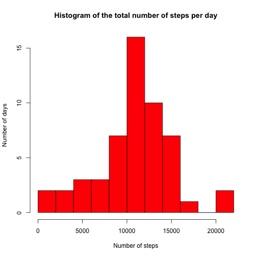
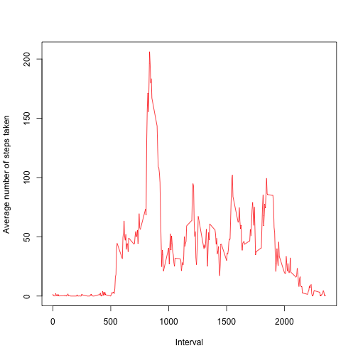
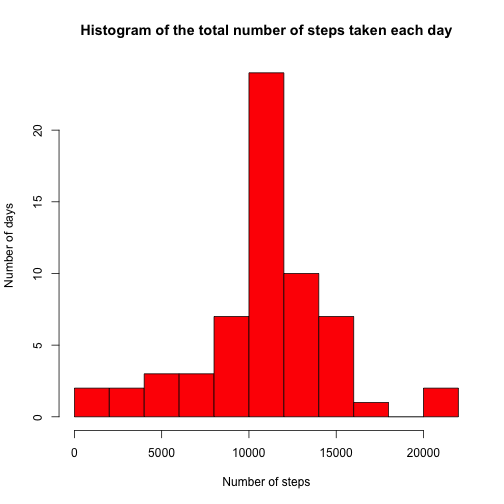
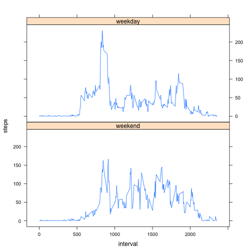

# Reproducible Research: Peer Assessment 1


## Loading and preprocessing the data

```r
fname <- unzip("activity.zip")
df <- read.csv(fname, colClasses = c("integer", "Date", "integer"))
```


## What is mean total number of steps taken per day?

```r
steps_per_day <- aggregate(steps ~ date, data = df, FUN = sum, na.action = na.omit)

hist(steps_per_day$steps, col = "red", main = "Histogram of the total number of steps per day", 
    xlab = "Number of steps", ylab = "Number of days", breaks = 15)
```

 


```r
mean(steps_per_day$steps)
```

```
## [1] 10766
```

```r
median(steps_per_day$steps)
```

```
## [1] 10765
```


### The mean from total number of steps taken per day is 1.0766 &times; 10<sup>4</sup>
### The median from total number of steps taken per day is 10765

## What is the average daily activity pattern?

```r
intervals_per_day <- aggregate(steps ~ interval, data = df, FUN = mean, na.action = na.omit)
plot(intervals_per_day, col = "red", xlab = "Interval", ylab = "Average number of steps taken", 
    type = "l")
```

 


```r
max_steps <- intervals_per_day[with(intervals_per_day, which.max(steps)), "interval"]
max_steps
```

```
## [1] 835
```


### Maximum number of steps represents the interval 835.

## Inputing missing values

```r
missing <- subset(df, is.na(steps))
nrow(missing)
```

```
## [1] 2304
```


### The total number of missing values in the dataset is 2304.

We fill the incomplete data with mean value per interval. This could be easily 
achieved by joining the dataset with *interval_per_day* variable:

```r
missing_without_steps <- missing[c("date", "interval")]
filled <- merge(missing_without_steps, intervals_per_day)
```


Merge to the complete data set

```r
complete <- rbind(filled, subset(df, !is.na(steps)))

steps_per_day <- aggregate(steps ~ date, data = complete, FUN = sum, na.action = na.omit)

hist(steps_per_day$steps, col = "red", main = "Histogram of the total number of steps taken each day", 
    xlab = "Number of steps", ylab = "Number of days", breaks = 15)
```

 


```r
mean(steps_per_day$steps)
```

```
## [1] 10766
```

```r
median(steps_per_day$steps)
```

```
## [1] 10766
```


### The mean from total number of steps taken per day is 1.0766 &times; 10<sup>4</sup>
### The median from total number of steps taken per day is 1.0766 &times; 10<sup>4</sup>
### As we can see, the filling NA values with mean for interval had only a slight impact causing almost no difference.

## Are there differences in activity patterns between weekdays and weekends?
A new factor variable in the dataset with two levels - "weekday" and "weekend" 
indicating whether a given date is a weekday or weekend day.


```r
weekinfo <- factor(ifelse(weekdays(complete$date) %in% c("Saturday", "Sunday"), 
    "weekend", "weekday"), levels = c("weekend", "weekday"))

complete <- cbind(complete, weekinfo)
```


Average number of steps taken, averaged across all days:

```r
library(lattice)
steps_per_day <- aggregate(steps ~ interval + weekinfo, data = complete, FUN = mean)
xyplot(steps ~ interval | weekinfo, data = steps_per_day, type = "l", layout = c(1, 
    2))
```

 

