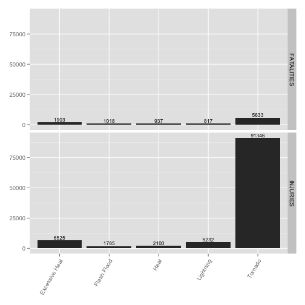
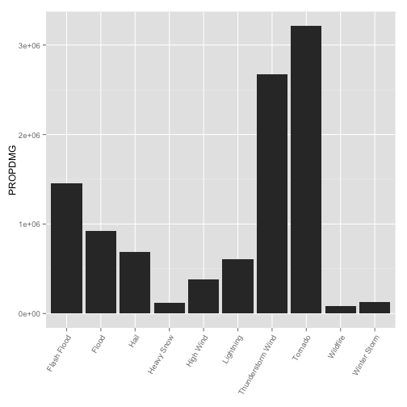

# Exploring the U.S. NOAA storm database to determine the impact of the weather events

## Synopsis
The goal of this analysis is to explore the NOAA Storm Database and answer 
questions about severe weather events. We have found that the most harmful 
event with respect to the population health is caused by tornado. The tornado 
together with the drought have greatest economic consequences in US. 

## Libraries


```r
library(reshape2)
library(ggplot2)
library(stringi)
```

## Loading and preprocessing the data

We need only fatalities, injuries, propdmg, propdmgexp, cropdmg, cropdmgexp entries from csv file.


```r
classes = rep(list(NULL), 37)
classes[c(8,23:28)] = c("character", "numeric", "numeric", "numeric", "character", "numeric", "character")
df <- read.csv("StormData.csv.bz2", colClasses = classes, strip.white = TRUE)
```

### Cleaning messy EVTYPE
Because EVTYPE column contains entries with numerous typos or incorrect values, 
we are making several corrections using regular expressions. Our solution does not
clear everything, but we need only the most significant (according occurence 
number) entries for plausible results.


```r
clean_evtype <- function(pattern, replacement) {
        df$EVTYPE[grepl(pattern, df$EVTYPE, ignore.case = TRUE)] <<- replacement
}

# Capitalize only first letters
df$EVTYPE <- stri_trans_totitle(df$EVTYPE)

# Clean leading blank or placeholders
clean_evtype('^[ ]+|Record +', '')

# Assign to non-specified type as 'Other'
clean_evtype('^$|\\?', 'Other')

# Basic transformations
clean_evtype('^avalanche', 'Avalanche')
clean_evtype('^blizzard', 'Blizzard')
clean_evtype('^coastal flood', 'Coastal Flood')
clean_evtype('^cold', 'Cold/Wind Chill')
clean_evtype('^flash flood', 'Flash Flood')
clean_evtype('^flood', 'Flood')
clean_evtype('^hail', 'Hail')
clean_evtype('^heavy rain', 'Heavy Rain')
clean_evtype('^heavy rain', 'Heavy Rain')
clean_evtype('^high surf', 'High Surf')
clean_evtype('^high wind', 'High Wind')
clean_evtype('^hurricane', 'Hurricane') 
clean_evtype('^lightning', 'Lightning')
clean_evtype('^tstm wi?nd|^thunderstorm', 'Thunderstorm Wind')
clean_evtype('^waterspout', 'Waterspout')
```

## Q1: Across the United States, which types of events (as indicated in the EVTYPE variable) are most harmful with respect to population health?

We summarise the fatality and injury occurences and visualise the first 5 events
according occurence.


```r
# agregate fatalities and injuries by EVTYPE 
by_fi <- aggregate(cbind(FATALITIES, INJURIES) ~ EVTYPE, data = df, FUN = sum)
by_fi_ordered <- by_fi[order(by_fi$FATALITIES, decreasing = TRUE), ]

# get top 5 events
top_fi = head(by_fi_ordered, n = 5)
melted <- melt(top_fi)
```

```
## Using EVTYPE as id variables
```

```r
names(melted) <- c("Event", "Type", "Occurence")

# plot data
ggplot(melted, 
        aes(Event, Occurence)) + 
        facet_grid(Type ~ .) + 
        geom_bar(stat = "identity") + 
        geom_text(aes(label = Occurence), size = 3, vjust = -0.3) + 
        theme(axis.text.x = element_text(angle = 60, hjust = 1), axis.title.x = element_blank(), axis.title.y = element_blank())
```

 


## Q2: Across the United States, which types of events have the greatest economic consequences?

Multiply CROPDMG and PROPDMG variables with constant according CROPDMGEXP 
and PROPDMGEXP value. 


```r
## Cleaning PROPDMGEXP and CROPDMGEXP
df_crop <- subset(df, select = c(EVTYPE, CROPDMG, CROPDMGEXP))
pattern_vector <- grepl('^k$', df_crop$CROPDMGEXP, ignore.case = TRUE)
df_crop[pattern_vector, "CROPDMG"] <- (df_crop[pattern_vector, "CROPDMG"] * 10^3)
pattern_vector <- grepl('^m$', df_crop$CROPDMGEXP, ignore.case = TRUE)
df_crop[pattern_vector, "CROPDMG"] <- (df_crop[pattern_vector, "CROPDMG"] * 10^6)
pattern_vector <- grepl('^b$', df_crop$CROPDMGEXP, ignore.case = TRUE)
df_crop[pattern_vector, "CROPDMG"] <- (df_crop[pattern_vector, "CROPDMG"] * 10^9)

df_prop <- subset(df, select = c(EVTYPE, PROPDMG, PROPDMGEXP))
pattern_vector <- grepl('^k$', df_crop$PROPDMGEXP, ignore.case = TRUE)
df_prop[pattern_vector, "PROPDMG"] <- (df_prop[pattern_vector, "PROPDMG"] * 10^3)
pattern_vector <- grepl('^m$', df_crop$PROPDMGEXP, ignore.case = TRUE)
df_prop[pattern_vector, "PROPDMG"] <- (df_prop[pattern_vector, "PROPDMG"] * 10^6)
pattern_vector <- grepl('^b$', df_crop$PROPDMGEXP, ignore.case = TRUE)
df_prop[pattern_vector, "PROPDMG"] <- (df_prop[pattern_vector, "PROPDMG"] * 10^9)
```

Now the data is summarised according occurence, we are using the same method as 
in Q1.


```r
# order by severity
df_crop_agg <- aggregate(CROPDMG ~ EVTYPE, data = df_crop, FUN = sum)
df_crop_ordered <- df_crop_agg[order(df_crop_agg$CROPDMG, decreasing = TRUE), c("EVTYPE", "CROPDMG")]

ggplot(head(df_crop_ordered, n = 10), aes(EVTYPE, CROPDMG)) + geom_bar(stat = "identity") + theme(axis.text.x = element_text(angle = 60, hjust = 1), axis.title.x = element_blank())
```

 

```r
df_prop_agg <- aggregate(PROPDMG ~ EVTYPE, data = df_prop, FUN = sum)
df_prop_ordered <- df_prop_agg[order(df_prop_agg$PROPDMG, decreasing = TRUE), c("EVTYPE", "PROPDMG")]

ggplot(head(df_prop_ordered, n = 10), aes(EVTYPE, PROPDMG)) + geom_bar(stat = "identity") + theme(axis.text.x = element_text(angle = 60, hjust = 1), axis.title.x = element_blank())
```

 

## Results
Using NOAA dataset, we have found, that the most fatal event is Tornado:


```r
head(top_fi)
```

```
##             EVTYPE FATALITIES INJURIES
## 496        Tornado       5633    91346
## 84  Excessive Heat       1903     6525
## 105    Flash Flood       1018     1785
## 152           Heat        937     2100
## 264      Lightning        817     5232
```

To answer the greatest economic consequences, we have analysed the property 
and crop damage with the following result:


```r
head(df_crop_ordered)
```

```
##          EVTYPE   CROPDMG
## 52      Drought 1.397e+10
## 107       Flood 5.879e+09
## 218   Hurricane 5.515e+09
## 337 River Flood 5.029e+09
## 233   Ice Storm 5.022e+09
## 149        Hail 3.026e+09
```

```r
head(df_prop_ordered)
```

```
##                EVTYPE PROPDMG
## 496           Tornado 3212258
## 487 Thunderstorm Wind 2673126
## 105       Flash Flood 1455150
## 107             Flood  926094
## 149              Hail  689737
## 264         Lightning  603430
```

As we can see from the table, dought is the most important factor causing crop 
damage and tornado for property damage.
